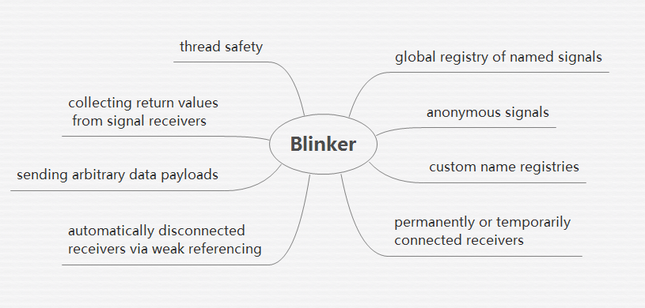

# blinker-try

An [blinker](https://pythonhosted.org/blinker/ "blinker")  feature tring project, blinker provides fast & simple object-to-object and broadcast signaling for Python objects. All feature of blinker as following graph:



## Examples

- Example01.py: using global registry of named signals, by normal way
- Example02.py: connect signal by decorator `@signal_name.connect` and get result
- Example03.py: testing blinker signal is **synchronized**, and if one callback break, all callback would break
- Example04.py: using anonymous signals
- Example05.py: using weak referencing and callbacked would be ignore when using weak reference
- Example06.py: testing permanently or temporarily connected receivers

## Usage

To try all example listed, only one step you should do:

	pip install -r requirements.txt

or just install `blinker`

	pip install blinker==1.4

and all runing args was writen in python file, such as `Example01.py`, comments are:

```python
"""
Example for testing `global registry of named signals`
usage:
    python example01.py         # you can't see anything print
                                # because nothing need to print
    python example01.py ready   # you can see something pring
                                # beacause signal sended

notice:
    signal.send(args)    # the args will be send to binded function
"""
```

